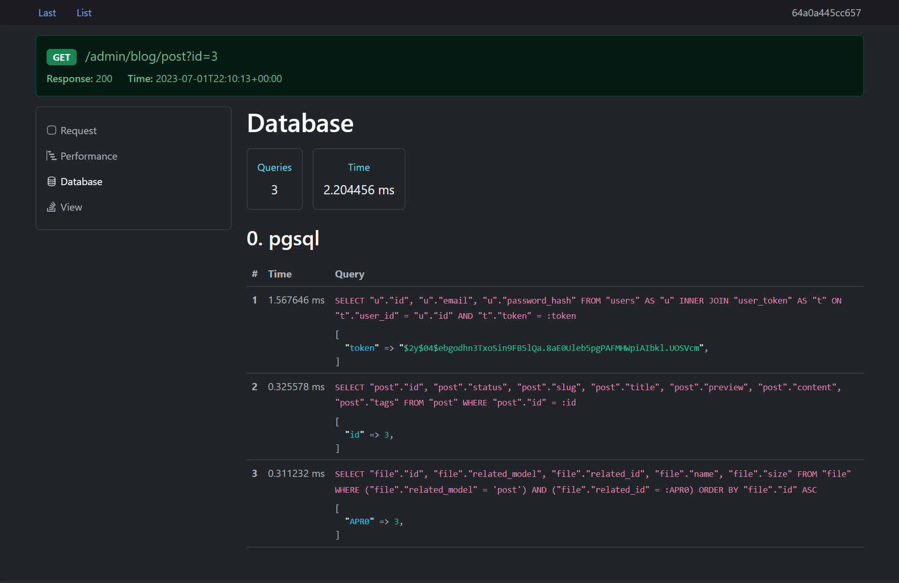

# Phalcon profiler

`composer require --dev serginhold/phalcon-profiler`

* PHP >= 8.0
* Phalcon >= 5.1
* ext-zip

## Install

Di:
```php
use Phalcon\Di\DiInterface;
use Phalcon\Mvc\Application;
use SerginhoLD\Phalcon\WebProfiler\WebProfiler;

/** @var DiInterface $di */
if ('dev' === $env) {
    $di->register(new WebProfiler());
}

/** @var Application $application */
$application->setEventsManager($di->getShared('eventsManager'));
```

Configure eventsManager:
```yaml
eventsManager:
  className: Phalcon\Events\Manager
  calls:
    - method: enablePriorities
      arguments:
        - { type: parameter, value: true }
```

Enable events in services:
```yaml
  dispatcher:
  db:
  view:
  volt:
    calls:
      - method: setEventsManager
        arguments:
          - { type: service, name: eventsManager }
```

## Profiler config

```php
// ./config/config.php

return [
    'profiler' => [
        'viewsCachePath' => '/var/www/var/cache/volt/',
        'tagsDir' => '/var/www/var/profiler',
        'routePrefix' => '/_profiler',
        'collectors' => [
            /** @see \SerginhoLD\Phalcon\WebProfiler\Collector\CollectorInterface */
            CustomCollector::class,
        ],
    ],
];
```

## Toolbar

```html
{# layout.volt #}
<body>
content


    <script>
        document.addEventListener('DOMContentLoaded', function () {
            fetch('{{ url(['for': '_profiler-bar', 'tag': _profilerTag])|escape_js }}')
                .then(function(res) { return res.text() })
                .then(function(data) {
                    document.body.innerHTML += data
                })
                .catch(function(e) {
                    console.error(e)
                })
        })
    </script>

</body>
```


## Stopwatch in production

Create a stopwatch adapter:
```php
use Phalcon\Di\DiInterface;
use Phalcon\Di\ServiceProviderInterface;

class StopwatchProvider implements ServiceProviderInterface
{
    public function register(DiInterface $di): void
    {
        $di->setShared('stopwatch', function () use ($di) {
            return $di->has('profilerStopwatch') ? $di->getShared('profilerStopwatch') : null;
        });
    }
}
```

Usage:
```php
$di->get('stopwatch')?->start('test');
// ...
$di->get('stopwatch')?->stop('test');
```

## Custom collector

```php
use SerginhoLD\Phalcon\WebProfiler\Collector\CollectorInterface;

class CustomCollector implements CollectorInterface
{
    public function templatePath(): string
    {
        return '/var/www/templates/custom'; // .volt
    }

    public function name(): string
    {
        return 'Custom';
    }

    public function icon(): string
    {
        return '';
    }

    public function collect(): array
    {
        return [
            'message' => 'hello',
        ];
    }
}
```

```html
{# custom.volt #}



    Message: {{ message|e }}

```

## Screenshot


